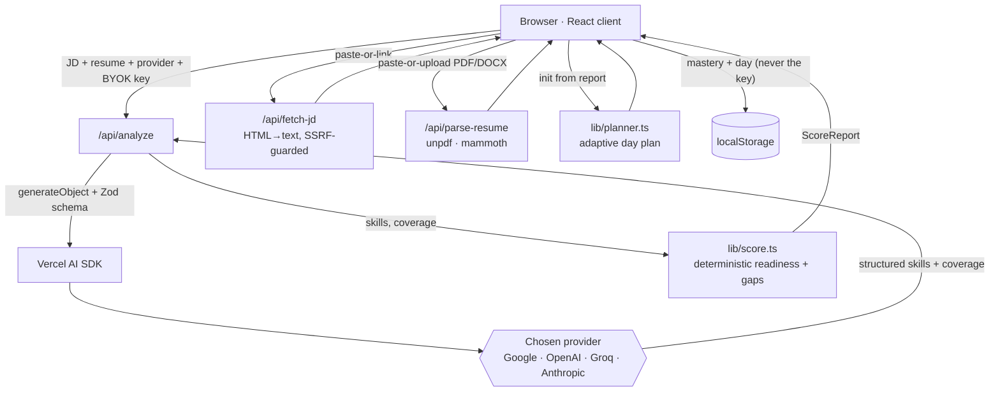

# PrepGap-Lens

**Paste a job description and your resume — get a readiness score, your biggest skill gaps, and an adaptive day-by-day study plan.**

[](https://prepgap-lens.vercel.app)
[](https://nextjs.org)
[](https://www.typescriptlang.org)
[](#testing)
[](https://prepgap-lens.vercel.app)

> **🔗 Live:** https://prepgap-lens.vercel.app

---

## Recruiter TL;DR

- **What it is:** A live web app that measures the gap between *your* resume and *a specific* job posting, then turns that gap into a concrete, adaptive study schedule.
- **Hardest problem solved:** Turning free-text (a JD + a resume) into a *structured, weighted skill map with per-skill coverage* using an LLM — behind a **single interface that works across four providers** (Google, OpenAI, Groq, Anthropic) with **bring-your-own-key**, while keeping all the scoring math deterministic and unit-tested rather than trusting the model with the numbers.
- **Why it's more than a demo:** it's deployed, security-reviewed (SSRF-guarded link fetching, keys never stored or logged), and the core logic has a real unit-test suite.

---

## Overview

Most interview-prep tools hand you a generic checklist. PrepGap-Lens is built around one idea: the useful thing isn't "study machine learning," it's **"study the machine-learning topics *this* posting emphasizes that *your* resume doesn't yet show — in impact order."**

You paste (or link/upload) a job description and your resume, bring your own API key for any major LLM provider, and get back:
1. an overall + per-category **readiness score**,
2. your **highest-impact skill gaps** (ranked by importance × how much you're missing), and
3. an **adaptive daily plan** that re-weights each day based on what you marked done, skipped, or hard.

It's a portfolio project: the goal was to build a real, deployed, LLM-powered product with a clean deterministic core and a security-conscious backend — not a notebook.

---

## Features

- **Bring-your-own-key (BYOK), 4 providers.** Pick Google, OpenAI, Groq, or Anthropic and paste your own key. The key is held in the browser tab only, sent for a single request, and **never stored (no DB, no localStorage, no env var) or logged**.
- **Model picker per provider**, with a sensible default and per-provider model lists.
- **JD input two ways:** paste it, or **fetch it from a link** (server-side HTML→text extraction).
- **Resume input two ways:** paste it, or **upload a PDF or Word (.docx)** file (parsed server-side).
- **Deterministic readiness scoring** — overall %, per-category %, and gaps ranked by `gap × weight`, with prerequisite penalties.
- **Adaptive day planner** — balances learn/practice/explain/review blocks, respects prerequisites, and adapts the next day from your feedback (skipped → retried, hard → reinforced). Seeded RNG makes plans reproducible.
- **Credibility-tagged resources** — each suggested resource is labelled interview-safe / good-intuition / misleading.
- **Progress persists** across refreshes via `localStorage` (the API key never does).

---

## Architecture

The design deliberately splits **fuzzy work (LLM)** from **exact work (deterministic TypeScript)**. The model only does what it's good at — reading messy text into structure. Every number a user sees (readiness, gaps, the plan) is computed by pure, unit-tested functions, so results are reproducible and explainable.



**Why this shape:**
- **BYOK + stateless** means the app holds *zero secrets* and needs *no database* — which is what makes it free to host and safe to open-source. The tradeoff is the key lives in the request; it's used for one call and discarded, never logged.
- **LLM boundary is narrow on purpose.** `generateObject` + a Zod schema forces the model's output into a validated shape; if it doesn't conform, the request fails loudly instead of producing garbage scores. Everything downstream is deterministic.
- **Multi-provider behind one SDK.** Switching providers is a dropdown, not four code paths. Groq's Llama models don't support the `json_schema` response format, so the analyze call disables structured outputs for Groq and lets the SDK fall back to tool-calling.
- **The link-fetch endpoint is a trust boundary** and is treated like one: it resolves each host (including every redirect hop) and refuses private, loopback, link-local, and cloud-metadata addresses to prevent SSRF.

---

## Tech Stack

| Layer | Choice | Why |
|---|---|---|
| Framework | **Next.js 16** (App Router) + **React 19** | One codebase for UI + serverless API routes; deploys to Vercel's free tier as-is |
| Language | **TypeScript 5** | The scoring/planner logic is the core IP — types keep it honest |
| LLM | **Vercel AI SDK** (`ai` 7) + `@ai-sdk/google` · `@ai-sdk/openai` · `@ai-sdk/groq` · `@ai-sdk/anthropic` (4) | Unified multi-provider interface; `generateObject` for schema-validated output |
| Validation | **Zod 4** | Schema for the LLM's structured output; fails closed on malformed responses |
| Parsing | **unpdf** (PDF) · **mammoth** (.docx) | Serverless-friendly, no native binaries |
| Styling | **Tailwind CSS 4** + custom CSS | Aurora/glass visual system |
| Testing | **Vitest 4** | Fast, TS-native unit tests for the pure logic |
| Hosting | **Vercel** (Hobby / free tier) | No env vars needed — the app is BYOK |

---

## Skills Demonstrated

- **LLM application development** — schema-constrained structured output (`generateObject` + Zod), a multi-provider abstraction, and a provider-specific fallback (tool-calling for Groq).
- **RESTful API design** — three focused serverless endpoints with input validation and typed error responses.
- **Application security** — SSRF prevention with per-redirect-hop host validation; secret handling that never persists or logs a user's API key; input validation at every trust boundary.
- **System design & architecture** — a deliberate LLM-vs-deterministic boundary, documented tradeoffs, and an in-repo audit (`AUDIT.md`).
- **Automated testing** — 10 unit tests across the scoring, planner, extraction, HTML, and SSRF-guard logic.
- **Cloud deployment** — live on **Vercel**, git-connected for auto-deploys.
- **Modern TypeScript / React** — Next.js App Router, React 19, strict typing across a small but real codebase.

---

## Getting Started

No environment variables or secrets to configure — the app is **bring-your-own-key**, so you enter a provider key in the UI at runtime.

```bash
git clone https://github.com/shiva-shivanibokka/PrepGap-Lens.git
cd PrepGap-Lens
npm install
npm run dev            # http://localhost:3000
```

To use it, get a free key from **[Google AI Studio](https://aistudio.google.com/app/apikey)** or **[Groq](https://console.groq.com/keys)** (both have free tiers), select that provider in the UI, and paste the key.

```bash
npm test               # run the unit tests
npm run build          # production build + typecheck
```

---

## Usage

**In the app:** choose a provider + model, paste your key, provide the JD (paste or link) and your resume (paste or upload), then **Analyze gap**.

**The API** (`POST /api/analyze`) is the core contract — JD + resume + BYOK credentials in, skills + a readiness report out:

```jsonc
// request
{
  "provider": "google",
  "apiKey": "<your key>",
  "model": "gemini-2.0-flash",        // optional; defaults per provider
  "jd": "Senior ML engineer, scikit-learn, model evaluation…",
  "resume": "Built classification models in Python; evaluated with F1 and ROC-AUC…"
}

// response
{
  "skills": [
    { "id": "model_evaluation", "name": "Model Evaluation", "category": "Core ML",
      "weight": 5, "prereqs": ["ml_basics"], "assessment": ["Explain precision vs recall."],
      "resources": [/* credibility-tagged */] }
    /* … */
  ],
  "report": {
    "readinessOverall": 0.62,
    "readinessByCategory": { "Core ML": 0.7, "MLOps": 0.3 },
    "topGaps": [ { "skillName": "Model Serving", "weight": 5, "coverage": 0.1, "gap": 0.9, "prereqsMissing": [] } ]
  }
}
```

The readiness math is pure and testable — e.g. overall readiness is a weight-weighted average of per-skill coverage:

```ts
scoreReadiness(skills, coverage);   // → { readinessOverall, readinessByCategory, topGaps, ... }
```

---

## Project Structure

```
app/
  api/analyze/route.ts        # BYOK LLM call → structured skills + readiness
  api/fetch-jd/route.ts       # fetch a JD from a link (SSRF-guarded, size-capped)
  api/parse-resume/route.ts   # parse an uploaded PDF/.docx into text
  page.tsx  layout.tsx  globals.css
components/                   # KeyBar, ResultsView, DayPlanView, Meter, Tip
lib/
  analyze.ts                  # Zod schema, prompt, generateObject, coverage split
  providers.ts                # provider registry + AI SDK model factory (BYOK)
  score.ts                    # deterministic readiness % + ranked gaps
  planner.ts                  # adaptive day planner (seeded, reproducible)
  html.ts  net.ts             # HTML→text, private-IP SSRF guard
  progress.ts  types.ts
  __tests__/                  # score · planner · analyze · html · net
AUDIT.md  PLAN.md             # in-repo bug audit + applied fix plan
docs/superpowers/plans/       # implementation plan
```

---

## Testing

Run `npm test` (Vitest). The suite has **10 tests across 5 files**, covering the parts where a silent regression would corrupt results:

- `score.test.ts` — weighted readiness + gap ranking + prerequisite penalties
- `planner.test.ts` — plan determinism (seeded), time-budget bounds, feedback routing
- `analyze.test.ts` — Zod schema validation + coverage-splitting
- `html.test.ts` — HTML→text extraction
- `net.test.ts` — the SSRF private-IP guard (loopback/private/link-local/metadata)

There is **no CI pipeline configured yet** (see Roadmap) — tests are run locally and before deploys.

---

## Deployment

Live on **Vercel** at https://prepgap-lens.vercel.app, git-connected so pushes to `main` auto-deploy. There are **no environment variables to set** — the app holds no secrets (BYOK). Deploy your own fork with `npx vercel --prod`.

---

## Impact / Results

This is a personal/portfolio project, so there are **no production usage metrics to report** — and I'd rather say that than invent one. What it does concretely:

- Replaces a vague "study for the interview" with a **ranked, JD-specific gap list and a time-boxed daily plan**, generated from a single paste.
- Keeps every displayed number **deterministic and unit-tested**, so a result can be explained and reproduced rather than being an opaque model output.
- Runs entirely on **free tiers** (Vercel + a free LLM key), so the cost to run it is zero.

---

## Roadmap / Future Work

Known limitations and honest next steps:

- **Link fetching is best-effort.** Static career pages extract cleanly; JavaScript-rendered or login/bot-gated postings (LinkedIn, some Workday/Greenhouse) won't — the UI falls back to Paste in those cases.
- **Suggested resource links are LLM-generated** and can occasionally be inaccurate. Planned: a curated resource table the model can only *pick from*, rather than invent.
- **No CI pipeline yet** — tests run locally. Planned: a GitHub Actions workflow running `npm test` + `npm run build` on every PR.
- **No automated end-to-end test of the live LLM path** (it needs a real key). The layers around it are unit-tested; a mocked-provider integration test is the next step.

---

## License

No license file is present yet, so all rights are reserved by default. If you'd like to reuse this, open an issue — an OSI license (likely MIT) is planned.
